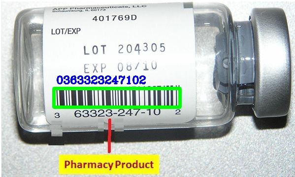
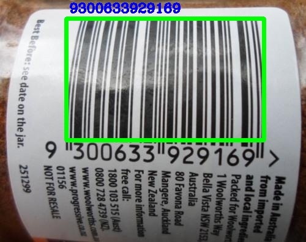
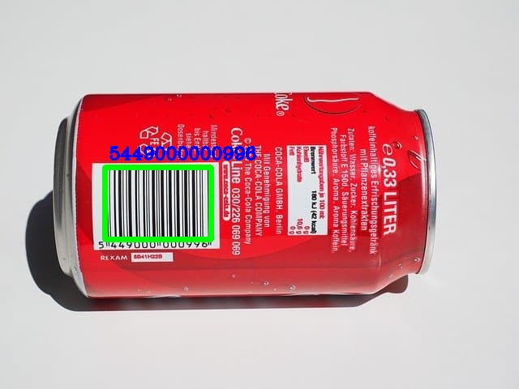
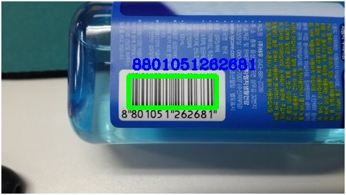

# Python |B|a|r|c|o|d|e Reader

Hello everyone. In this repo i made a python script to detect and read **barcode**.  
This would be useful in many cases such as any store which sale products with barcodes.

## Results

  

  

  

